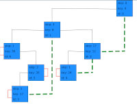
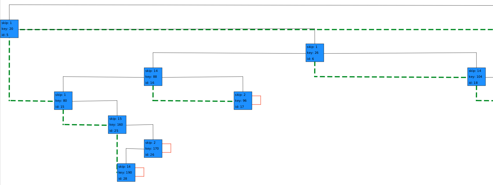
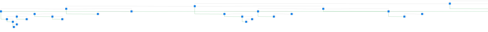

# TrieTreeImplementations
Patrcia tree implementation in accordance with directions from Knuth's book "The Art of Computer Programming vol. 3 Sorting and Searching 2nd edition"

# Features
1. Parameterized End Of File and End Of Key characters
1. 2 Encodings (bit representations)
    1. Java (UTF-16)
    1. MIX 
        1. 5 bit
        1. range: 0-31 
        1. modified, with guarantied encoding for End Of File and End Of Key characters
            1. 30 - EOK character
            1. 31 - EOF character
1. 2 Strategies (as to what is considered a key)
    1. Single word strategy - words separated by End Of Key character
    1. Start position to end of file strategy - word starting at certain position going all the way to the End Of File character (including), or until real End Of File
1. 3 Operations
    1. Key
        1. Insert
        1. isContaining (Look-up)
        1. findNodeMatching (Search) 
    1. Prefix
        1. isContaining (Look-Up)
        1. findNodesMatching (Search)
1. Tests:
    1. 559 instances of compound tests 
    1. Coverage: 
        1. Class: 80%
        1. Method: 75%
        1. Line: 75%
1. Graphical representation via JavaFX library and com.sirolf2009:fxgraph library (heavily modified to suit my needs).
     \
    Edge legend: 
        1. Black - children
        1. Orange - loops
        1. Green - ancestors \
    More examples:
     \
     
    1. To launch type in console 
        1. `export MAVEN_OPTS="-Xms1024M -Xmx2048M -Xss4M -XX:MaxMetaspaceSize=4096M"` 
        1. `mvn clean javafx:run -e` 
    (it is required to be in .../TrieTreeImplementations folder)
