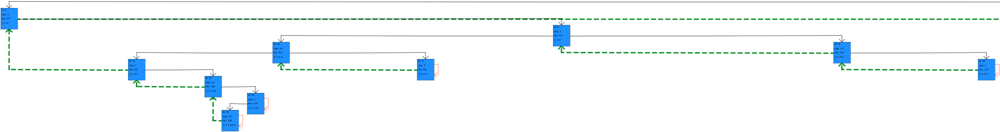

# TrieTreeImplementations
Patricia tree implementation in accordance with directions from Knuth's book "The Art of Computer Programming vol. 3 Sorting and Searching 2nd edition" section "Digital searching".

# Thesis 
This a program prepared for my engineering thesis. The thesis subject is "Trie tree implementation".

# Written thesis
You can find file with containing my written thesis in polish language at the [link](https://github.com/axal25/TrieTreeImplementations/latex/written_thesis/thesis.pdf). 

The latex file needed to compile the written thesis can be found in [latex/written_thesis folder](https://github.com/axal25/TrieTreeImplementations/latex/written_thesis). 
# Thesis presentation
You can find file with containing my thesis presentation in polish language at the [link](https://github.com/axal25/TrieTreeImplementations/latex/thesis_presentation/presentation.pdf). 

The latex file needed to compile the thesis presentation can be found in [latex/thesis_presentation folder](https://github.com/axal25/TrieTreeImplementations/latex/thesis_presentation). 

# Launch options
1. Main class (agh.jo.App): 
    1. type in console: 
        1. `mvn clean package`
        1. `java -jar target/TrieTreeImplementations_complete_standalone.jar Visual 0 false` \
        or \
        `java -jar target/TrieTreeImplementations_complete_standalone.jar Text 9 true`
    1. allowing you to choose which application mode to run (via 1st argument) [visual, text]
    1. allowing you to choose which example to run (via 2nd argument) [0-9]
    1. allowing you to choose is the program suppose to convert CNF file to Patricia source file (via 3rd argument) [true, false]
1. Default example in visualization mode of PatriciaTree class 
    1. type in console: \
           1. `export MAVEN_OPTS="-Xms1024M -Xmx2048M -Xss4M -XX:MaxMetaspaceSize=4096M"` \
           1. `mvn clean javafx:run -e` \
           or for debugging: \
           `mvnDebug clean javafx:run -e -X` 
1. 570 tests (testing PatriciaTree class and it's components)
    1. run via IntelliJ JUnit Plugin \
    (running from console doesn't consider test classes not ending with exactly "text")

# Features
1. Parameterized End Of File and End Of Key characters
1. MixMachine - 2 Encodings (bit representations)
    1. Java (UTF-16)
    1. MIX 
        1. 5 or 6 bits
        1. range: 0-31 (5 bits) or 0-55 (6 bits)
        1. modified, with guarantied encoding for End Of File and End Of Key characters
            1. 30 - EOK character
            1. 31 - EOF character
1. FileOps - 2 Strategies (as to what is considered a key)
    1. Single word strategy - words separated by End Of Key character
    1. Start position to end of file strategy - word starting at certain position going all the way to the End Of File character (including), or until real End Of File
1. PatriciaTree - 5 Operations
    1. Key
        1. insertNextKeyIntoTree (Insert)
        1. isContaining (Look-up)
        1. findNodeMatching (Search) 
    1. Prefix
        1. isContaining (Look-Up)
        1. findNodesMatching (Search)
1. Tests:
    1. 570 instances of compound tests 
    1. Coverage: 
        1. Overall
            1. Class: 43%
            1. Method: 50%
            1. Line: 45%
        1. cnf.converter
            1. Class: 100%
            1. Method: 88%
            1. Line: 94%
        1. knuth
            1. Class: 100%
            1. Method: 77%
            1. Line: 80%
        1. ui
            1. Class: 0%
            1. Method: 0%
            1. Line: 0%
        1. utils
            1. Class: 60%
            1. Method: 75%
            1. Line: 63%
1. Graphical representation via JavaFX library and com.sirolf2009:fxgraph library (heavily modified to suit my needs).
    
    1. Edge legend: 
        1. Black - children
        1. Orange - loops
        1. Green - ancestors \
    1. Larger tree:
     
    1. Zoomed out (larger tree):
     
    1. To launch type in console (default example): 
        1. `export MAVEN_OPTS="-Xms1024M -Xmx2048M -Xss4M -XX:MaxMetaspaceSize=4096M"` 
        1. `mvn clean javafx:run -e` \
        or for debugging: \
        `mvnDebug clean javafx:run -e -X` \
    (it is required to be in .../TrieTreeImplementations folder)
1. CNFConverter (CNF source file conversion to PatriciaTree source file) 
1. Class diagram for package agh.jo.knuth
     
